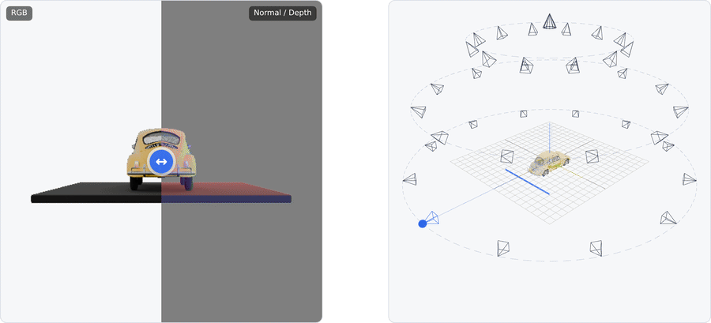

<div align="center">

#  Dome-Objaverse

**83,296 Objaverse objects &nbsp;·&nbsp; 48 views each &nbsp;·&nbsp; 4 elevations &times; 12 azimuths &nbsp;·&nbsp; 512&times;512 RGBA + normal/depth**

<p align="center">
  <a href="https://huggingface.co/datasets/zeyuanyin/Dome-Objaverse"></a>
  &nbsp;&nbsp;
  <a href="https://zeyuanyin.github.io/Dome-Objaverse/"></a>
  &nbsp;&nbsp;
  <a href="https://github.com/zeyuanyin/Dome-Objaverse"></a>
</p>

[](https://zeyuanyin.github.io/Dome-Objaverse/#object=0/10228&split=dome_objaverse)

*The 48 views in order: three azimuth rings at elevations 0°, 30° and 60° (connected by dashed orbit guide lines), plus a top-down ring at 90°. The highlighted camera on the dome is the one that took the image on the left.*

</div>

---

Rendering is the central compute bottleneck of multi-view 3D datasets. Our rendered pixels already exist — 512×512 RGBA plus per-view normal and depth maps, ~1.5 TB for the primary split and freely downloadable — so you can start training immediately. Every object is paired with its Objaverse UID and a Cap3D caption, covering both image- and text-conditioned pipelines out of the box. ***Dome*** is literal: all cameras sit on the upper hemisphere (elevations 0° to 90°), with nothing below the horizon.

- **Data**: [zeyuanyin/Dome-Objaverse](https://huggingface.co/datasets/zeyuanyin/Dome-Objaverse) (Hugging Face, CC-BY-4.0, ~1.5 TB primary split, parquet-packaged) — for training / bulk download.
- **Viewer website**: [https://zeyuanyin.github.io/Dome-Objaverse/](https://zeyuanyin.github.io/Dome-Objaverse/) — search all 83,296 captions, step through every view beside the camera that captured it, with full-resolution RGB, normal/depth, and interactive 3D fused point clouds rendered directly in the browser.
- **Code**:
  - 🚀 **Using the data** (`pipeline/4-usage/`, skip pipelines 1–3):
    ```text
    pipeline/4-usage/
    ├── load_views.py             # Decode RGB, normal, and depth for any object ID and split
    ├── lookup_metadata.py        # Look up captions, Objaverse UIDs, and camera distances
    └── reconstruct_pointcloud.py # Fuse all 48 depth maps into a colored 3D point cloud (.ply)
    ```
  - 🔧 **Reproducing or customizing renders** (`pipeline/1–3/`):
    - `pipeline/1-download/` — fetch source GObjaverse renders and 3D meshes.
    - `pipeline/2-render/` — Blender scripts for our dome rendering setup.
    - `pipeline/3-package/` — pack raw renders into parquet files on Hugging Face.

## Multi-view Render Datasets

| Dataset | Objects | Views | Release level | Elevation coverage |
|---|---|---|---|---|
| [Zero123++ v1.2](https://github.com/SUDO-AI-3D/zero123plus) | — | 6 | ❌ model config | Two fixed values: `20°` / `-10°` |
| [MVDream](https://arxiv.org/pdf/2308.16512) | — | 4 | ❌ model config | Single fixed elevation |
| [SV3D](https://arxiv.org/pdf/2403.12008) | — | 21 | ❌ no renders | Low elevation `[-5°, 30°]` |
| [TRELLIS-500K](https://github.com/microsoft/TRELLIS/blob/main/DATASET.md) | 500K | 150 | ❌ scripts only | Full sphere, dense |
| [G-buffer Objaverse](https://aigc3d.github.io/gobjaverse/) | 280K | 40 | ✅ ~1.1 TB | Low elevation side views (≤30°) + top/bottom (±90°) |
| **[Dome-Objaverse](https://huggingface.co/datasets/zeyuanyin/Dome-Objaverse)** | **83,296** | **48** | **✅ ~1.5 TB †** | **Upper hemisphere, 4 rings: `0°`, `30°`, `60°`, `90°`** |

*† Primary `dome_objaverse` split only. A supplementary `gobjaverse_parquet` split (~1.1 TB) is also included for baseline comparisons — see [Splits & Metadata](#splits--metadata).*

## Splits & Metadata

Both splits cover the exact same **83,296 objects** with zero missing objects.

| Split | Description & Source | Views | Elevation | Azimuth |
|---|---|---|---|---|
| **`dome_objaverse`** *(Primary)* | Our custom dome render pass (1.4 TB) | **48** | `0°, 30°, 60°, 90°` (4 rings) | `0°, 30°, ..., 330°` (12 steps/ring) |
| **`gobjaverse_parquet`** | Re-packed from original [G-buffer Objaverse](https://aigc3d.github.io/gobjaverse/) renders for baseline supervision (1.1 TB) | **40** | Side rings `≤30°` (varies/object) + `±90°` poles | Mixed `15°` / `30°` steps |

- **`dome_objaverse` view indexing**:
  - `view_id` 0–11: elevation `0°`, azimuths `0°, 30°, ..., 330°`
  - `view_id` 12–23: elevation `30°`, azimuths `0°, 30°, ..., 330°`
  - `view_id` 24–35: elevation `60°`, azimuths `0°, 30°, ..., 330°`
  - `view_id` 36–47: elevation `90°` (top-down), azimuths `0°, 30°, ..., 330°`
- **`gobjaverse_parquet` view indexing**: camera parameters are read dynamically per-view from the embedded `00000.json` ... `00039.json` metadata files — roughly 25 side views at `15°` azimuth steps plus 13 at `30°` steps, plus dedicated top/bottom pole views.

### File schemas

```text
dome_objaverse/{group}/{id}.parquet      # 48 rows/file -- one row per view
├── view_id    int64
├── image_png  binary  # 8-bit RGBA PNG
└── nd_png     binary  # 16-bit normal + depth PNG

gobjaverse_parquet/{group}/{id}.parquet  # 200 rows/file -- key-value blobs
├── keys    string
└── values  binary

metadata/objects.parquet                 # 83,296 rows -- one row per object (5 MB, in this repo)
├── object_id        string  # e.g. "0/10228" -- matches the parquet path on Hugging Face
├── group_id         int64   # first half of object_id (int)
├── index_id         int64   # second half of object_id (int)
├── objaverse_uid    string  # original Objaverse UUID for mesh/license lookup
├── glb_path         string  # relative GLB path in the Objaverse dataset
├── caption          string  # Cap3D text description
├── camera_distance  double  # per-object render distance (1.50-2.00)
├── sheet_id         int64   # viewer-internal: thumbnail sheet index
└── sheet_pos        int64   # viewer-internal: position within that sheet
```

```python
import pyarrow.parquet as pq
table = pq.read_table("metadata/objects.parquet")
print(table.num_rows)  # 83296
```

The repo also ships `gobjaverse_index_to_objaverse.json`, `camera_distances.json`, and `text_captions_cap3d.json` as supplementary legacy files; all their information is already consolidated in `objects.parquet`.

## Rendering

Defined in `pipeline/2-render/blender_script.py` (archived snapshot from production):

- **Engine & Resolution**: Blender `CYCLES`, `512×512` RGBA.
- **Normal & Depth Format**: Re-encoded into 16-bit PNG (`nd_png`):
  - **Depth**: Planar $z$-depth along camera optical axis, scaled as $\text{depth} = \frac{\text{alpha}}{65535} \times 5.0$.
  - ⚠️ **Normal Channel Order**: Packed via OpenCV (which writes BGRA), so channels are reversed: **R = normal $z$, G = normal $y$, B = normal $x$**. Decode as:
    $$\vec{n} = \left(\frac{\text{B}}{65535}\times 2 - 1, \; \frac{\text{G}}{65535}\times 2 - 1, \; \frac{\text{R}}{65535}\times 2 - 1\right)$$
- **Camera Optics**: Fixed horizontal FOV of `0.691150367` rad (39.6°), pointed at the origin.
  - ⚠️ **Camera distance is per object**: varies from `1.50` to `2.00` across objects (recorded in `metadata/camera_distances.json` and `metadata/objects.parquet`).
  - **Camera basis**: Right vector is derived directly from azimuth `(-sin(az), cos(az), 0)` to prevent the pole singularity at elevation 90°.

```python
import io
import cv2
import numpy as np
import pyarrow.parquet as pq
from PIL import Image

# Read row-per-view from dome_objaverse
table = pq.read_table("dome_objaverse/0/10010.parquet")
first_row = table.to_pylist()[0]

# 8-bit RGBA color
rgb = Image.open(io.BytesIO(first_row["image_png"]))

# 16-bit Normal / Depth (must use cv2.IMREAD_UNCHANGED to preserve full 16-bit precision)
nd = cv2.imdecode(np.frombuffer(first_row["nd_png"], np.uint8), cv2.IMREAD_UNCHANGED)
assert nd.dtype == np.uint16

normal = (nd[..., :3] / 65535.0 * 2.0 - 1.0)  # cv2 handles BGR swap -> [nx, ny, nz]
depth = nd[..., 3] / 65535.0 * 5.0             # planar z-depth in meters
print("View:", first_row["view_id"], "RGB size:", rgb.size, "Depth shape:", depth.shape)
```

For end-to-end usage examples, see `pipeline/4-usage/`:
- `load_views.py`: decodes RGB, normal, and depth maps for any object ID and split.
- `lookup_metadata.py`: quick lookup for captions, UIDs, and camera distances.
- `reconstruct_pointcloud.py`: fuses all 48 depth maps into a colored 3D point cloud (`.ply`).

## License

Code in this repository is Apache-2.0 (see `LICENSE`), matching [AI2](https://allenai.org/)'s [objaverse-rendering](https://github.com/allenai/objaverse-rendering),
which `render/` derives from. The rendered image data on Hugging Face is CC-BY-4.0. Individual
Objaverse source meshes carry their own licenses — use `objaverse_uid` in
`metadata/objects.parquet` to look them up.

## Attribution

- Source meshes: [Objaverse](https://huggingface.co/datasets/allenai/objaverse) ([Allen Institute for AI / AI2](https://allenai.org/)).
- Original camera convention and the 280k render set: [GObjaverse](https://aigc3d.github.io/gobjaverse/) / [RichDreamer](https://github.com/xianggang/richdreamer).
- The curated 83k-object subset comes from
  [ashawkey/objaverse_filter](https://github.com/ashawkey/objaverse_filter).
- Captions: [Cap3D](https://huggingface.co/datasets/tiange/Cap3D).
- Rendering scripts derive from AI2's [objaverse-rendering](https://github.com/allenai/objaverse-rendering) (Apache-2.0; see `pipeline/2-render/LICENSE`).

Please also cite the original [Objaverse](https://huggingface.co/datasets/allenai/objaverse) / [GObjaverse](https://aigc3d.github.io/gobjaverse/) sources and state which split(s) you used.

## Citation

This dataset is an extension of our NeurIPS 2025 publication,
[TRIM: Scalable 3D Gaussian Diffusion Inference with Temporal and Spatial Trimming](https://arxiv.org/abs/2511.16642).
If you find it helpful, please consider citing:

```bibtex
@inproceedings{
    Yin2025TRIM,
    title={{TRIM}: Scalable 3D Gaussian Diffusion Inference with Temporal and Spatial Trimming},
    author={Yin, Zeyuan and Liu, Xiaoming},
    booktitle={The Thirty-ninth Annual Conference on Neural Information Processing Systems (NeurIPS)},
    year={2025}
}
```
